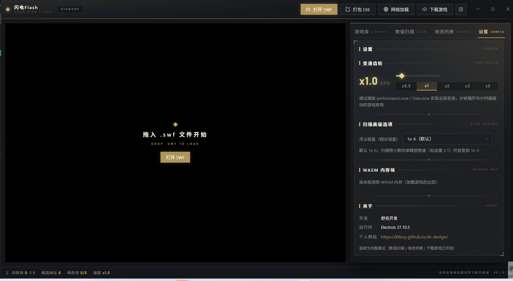

<p align="center">
  <b>⚡ Flash Game Trainer</b><br/>
  通用 Flash 游戏播放器 · 基于 Ruffle(WASM) 模拟运行<br/>
  游戏运行 · 游戏下载 · 游戏库 · 打包/还原 EXE · 变速齿轮
</p>

---

Flash Game Trainer 是一个开源的桌面工具，让经典 Flash 游戏在当下继续运行：
内置 Ruffle 模拟器加载 SWF，**无需针对单个游戏做任何配置**，对绝大多数
Flash 游戏通用（AVM1/AS2 与 AVM2/AS3 均支持）；并集成了 oldswf 游戏下载、
游戏库管理，以及 Flash ⇄ EXE 双向打包还原与全局变速能力。

> ⚠️ 仅供本地单机游戏学习研究使用，请勿用于任何破坏游戏公平性的场景。

## 界面预览



## 功能

- **游戏运行**：本地文件（对话框/拖拽）、网络 URL、游戏库一键重开；播放/暂停/重启/音量/全屏
- **游戏下载**：内置 oldswf.com 下载器——驱动本机 Edge/Chrome 监听游戏分片下载并重组
  （绕过其 TLS 指纹反爬），完成后自动载入并计入游戏库
- **游戏库**：下载 → 收藏 → 重玩 → 打包的游戏中枢
- **打包 / 还原 EXE**：Flash ⇄ EXE 双向——SWF 附加到 Flash 独立播放器末尾生成双击即玩单文件 EXE（移植自 cali.so，支持当前游戏或任意本地 SWF、内置/自定义播放器）；也能按 projector 页脚从这类 EXE 中提取回原始 SWF
- **变速齿轮**：0.1x–10x 全局时间缩放

## 快速开始

```bash
npm install      # 自动复制 Ruffle 运行时
npm run dev      # 开发模式
```

打包 Windows 安装包：

```bash
npm run dist
```

## 使用方法

见 [docs/USAGE.md](docs/USAGE.md)（运行 / 下载 / 打包游戏操作步骤与 FAQ）。

## 文档

| 文档 | 内容 |
| --- | --- |
| [docs/FEASIBILITY.md](docs/FEASIBILITY.md) | 可行性分析：四条技术路线对比、逐项可行性、已知限制 |
| [docs/ARCHITECTURE.md](docs/ARCHITECTURE.md) | 架构：补丁时序、内存 detach 防护、引擎可测试性、类型安全 IPC |
| [docs/USAGE.md](docs/USAGE.md) | 操作教程与常见问题 |

## 技术栈

Electron 37 · React 18 · Zustand · Ant Design 5 · TypeScript strict ·
Vitest · [Ruffle](https://ruffle.rs)（WASM Flash 模拟器）·
playwright-core（驱动系统 Edge/Chrome 做游戏下载）

界面采用 [Resonance HUD](https://github.com/KTBOY/resonance-hud) 深色金调游戏 HUD
设计语言：近黑基底、单一品牌金、发丝级描边、纯直角、L 形四角角标、中英双语区块标题、
菱形节点与点阵括号装饰（技能定义见 `.agents/skills/resonance-hud/`）。

## 开发

```bash
npm run typecheck   # 双 project 严格类型检查
npm run test        # 核心引擎单元测试
npm run lint        # ESLint 9 flat config
npm run format      # Prettier
```

## License

[MIT](LICENSE) · Ruffle 运行时遵循 Apache-2.0 / MIT 双许可
